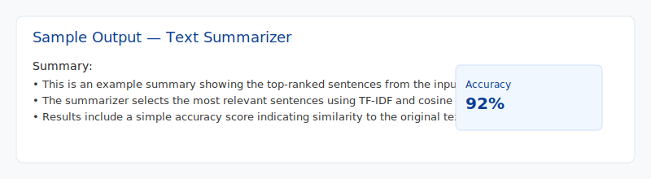

# Text Summarizer

A lightweight Flask app that summarizes text and reports a simple accuracy score.



Repository: https://github.com/kasuanitha/Text_summarizer

## Quick start

- Clone:
  ```bash
  git clone https://github.com/kasuanitha/Text_summarizer.git
  cd Text_summarizer
  ```
- Create venv and install:
  ```bash
  python -m venv venv
  venv\Scripts\activate    # Windows
  pip install -r requirements.txt
  ```
- Run the app:
  ```bash
  python app.py
  ```
- Open `http://localhost:5000` in your browser to use the web UI.

## What you'll see

- An input area for your text
- A generated summary (top sentences)
- A simple accuracy score indicating similarity between original and summary

## Files added/changed

- `assets/output.svg`: example screenshot showing the summary output
- Updated `README.md` to include the correct repository URL and embedded sample image

If you'd like, I can commit and push these changes to your GitHub repository for you—shall I proceed?
